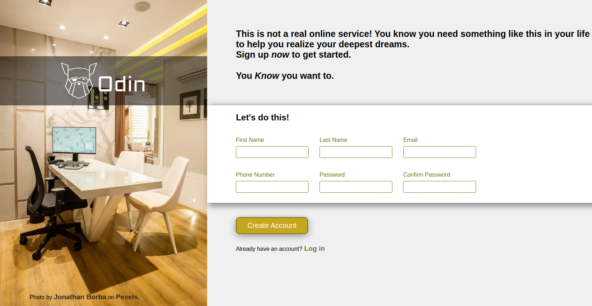

# Sign Up Form

:point_right: [live demo](https://cmfernandes.github.io/sign-up-form/) 

---

## About

This project was made to practice CSS and form inputs.

The  scope of the design was to desktop view only.

Assigment from [The Odin Project](https://www.theodinproject.com/lessons/node-path-intermediate-html-and-css-sign-up-form#project-solution) Intermediate HTML/CSS course.

## Credits

Photo by Jonathan Borba on [Pexels]("https://www.pexels.com/").
